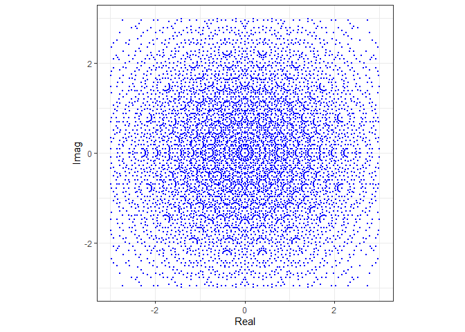

<!-- README.md is generated from README.Rmd. Please edit that file -->

# gallery

<!-- badges: start -->

[](https://codecov.io/gh/tXiao95/gallery)
[](https://travis-ci.org/tXiao95/gallery)
<!-- badges: end -->

The goal of gallery is to replicate the [MATLAB gallery of test
matrices](https://www.mathworks.com/help/matlab/ref/gallery.html) in R.

## Installation

You can install the released version of gallery from
[GitHub](https://github.com/tXiao95/gallery) with:

``` r
devtools::install_github("tXiao95/gallery")
```

## Example

This example can be found on the MATLAB website. We will plot the
distribution of eigenvalues from a sample of 20,000 random circulant
matrices of size 18 by 18 in the complex plane.

``` r
library(gallery)
library(ggplot2)

E <- matrix(0, nrow = 18, ncol = 20000)

for(i in 1:20000){
  x <- -0.4 + 0.8*sample(0:1, 18, replace = TRUE)
  A <- gallery::circul(x)
  E[,i] <- eigen(A, only.values = TRUE)$values
}

df <- data.frame(Real = Re(c(E)), Imag = Im(c(E)))

ggplot(df, aes(Real, Imag)) + 
  geom_point(col = "blue", size = 0.5) + 
  scale_x_continuous(limits=c(-3,3)) +
  scale_y_continuous(limits=c(-3,3)) + 
  coord_fixed(ratio=1) + 
  theme_bw()
#> Warning: Removed 10085 rows containing missing values (geom_point).
```


